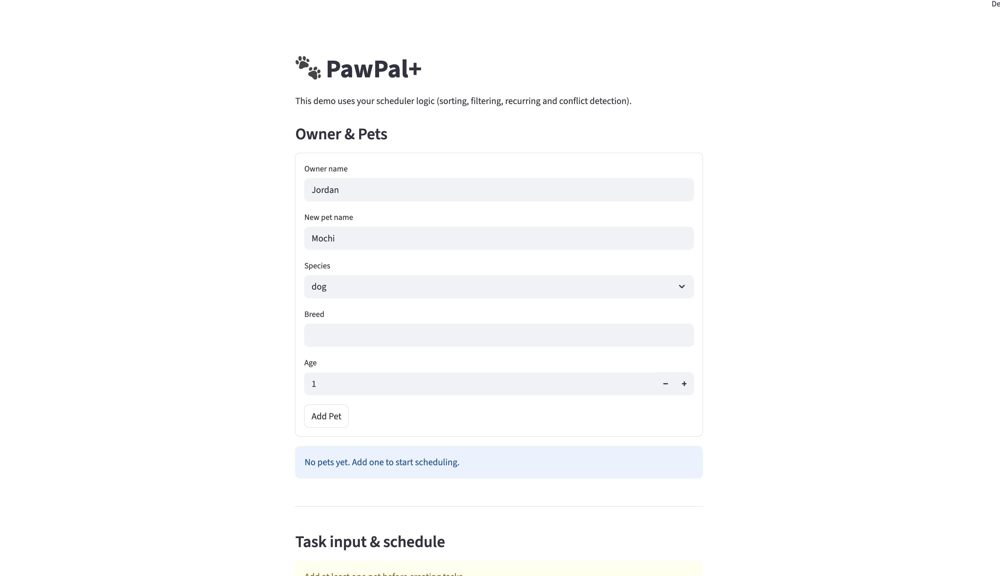
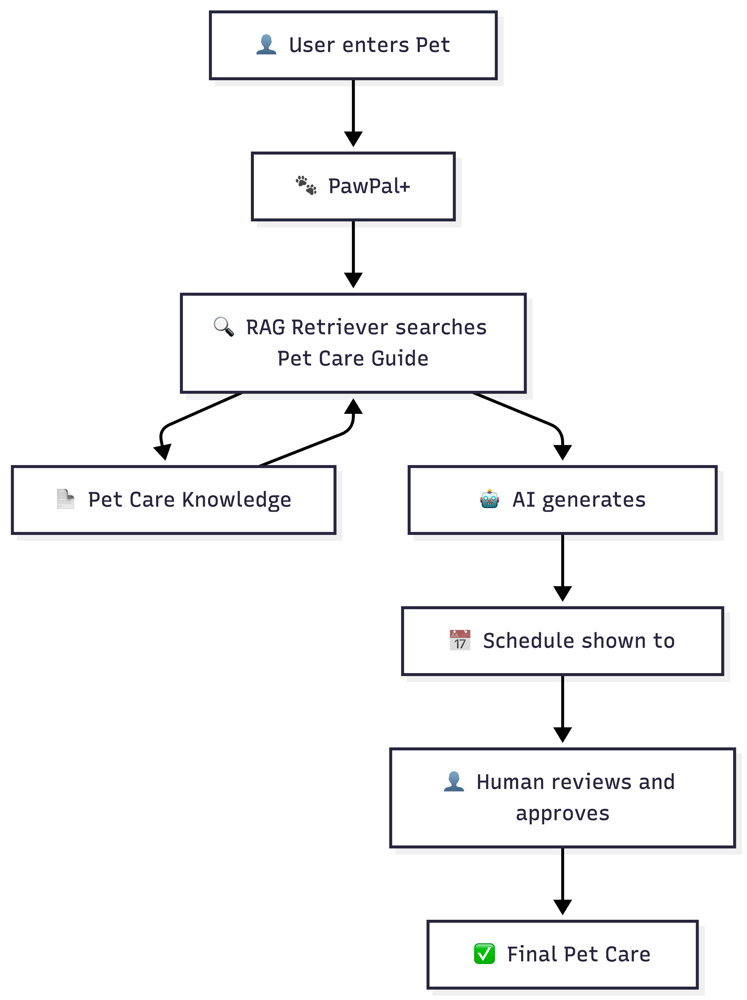

# PawPal+ — AI-Enhanced Pet Care Scheduler

I built PawPal+ as part of my CodePath Applied AI Systems course. It started as a pet care scheduling app and I extended it with a RAG (Retrieval-Augmented Generation) system that gives personalized, breed-specific care advice — no API key or internet connection required.

---

## Demo Walkthrough

> 🎥 **Loom video:** > 🎥 **Demo Video:** [Watch the PawPal+ Demo](https://www.loom.com/share/2f1491a86a59419d89a59c5180c6f0e3)

**Screenshot walkthrough:**



*Add 2–3 screenshots to the `assets/` folder showing: (1) adding a pet, (2) clicking Get AI Care Advice, (3) the confidence score and care guide output.*

---

## Original Project (Modules 1–3)

My original project was called **PawPal+**, a pet care task scheduling system. I designed it around four classes: `Owner`, `Pet`, `Task`, and `Scheduler`. The app let users add pets, create care tasks like feeding and walking, sort tasks by time, filter by completion status or pet name, detect scheduling conflicts, and automatically create the next occurrence of recurring daily or weekly tasks. I built it to help busy pet owners keep track of their pet routines using a Streamlit web interface.

---

## Title & Summary

**PawPal+ with RAG** is an extension of my original scheduler. I added an AI Care Advisor that uses Retrieval-Augmented Generation to give personalized pet care advice. When a user selects a pet, my system searches a knowledge base I built myself for facts that match the pet's species, breed, and age stage — puppy, adult, or senior. It then formats those facts into a care guide with sections for feeding, exercise, grooming, and health.

I built this because generic pet care advice is too broad to be actually helpful. A 5-year-old Husky needs very different care than a senior Chihuahua. My system makes the advice specific to each pet, and it works completely offline for free.

---

## System Architecture



My architecture diagram shows six stages:

| Stage | What Happens |
|---|---|
| **User enters Pet** | I fill in pet name, species, breed, and age in the Streamlit form |
| **PawPal+** | The app stores the pet using the `Owner` and `Pet` classes I built in Modules 1–3 |
| **RAG Retriever searches Pet Care Guide** | My `retrieve_facts()` function in `rag_engine.py` searches `pet_care_knowledge.py` using keyword matching |
| **Pet Care Knowledge** | A knowledge base I wrote with 100+ facts covering 20+ breeds across dogs, cats, rabbits, guinea pigs, hamsters, and birds |
| **Formats care guide** | My `format_care_guide()` function groups the retrieved facts into readable sections |
| **Human reviews and approves** | I read the care guide and manually add the tasks I want into my scheduler |

I made the decision to not use any AI API in the final version, so the whole thing runs for free with no rate limits.

---

## Setup Instructions

### Prerequisites
- Python 3.10 or higher
- pip

### 1. Clone the repository
```bash
git clone <your-repo-url>
cd applied-ai-system-project
```

### 2. Install dependencies
```bash
pip install streamlit
```

### 3. Run the app
```bash
streamlit run app.py
```

The app opens in your browser at `http://localhost:8501`.

### 4. Run the tests
```bash
pytest test_pawpal_system.py -v
```

---

## How to Use

1. **Add a pet** — Fill in the Owner & Pets form at the top. Enter the pet's name, species, breed, and age. Click **"Add Pet"**.
2. **Schedule tasks** — Use the Task input section to add care tasks with a time and frequency.
3. **Get care advice** — Scroll to **AI Care Advisor** at the bottom. Select your pet and click **"Get AI Care Advice"**. You'll instantly see breed-specific, age-appropriate care tips.
4. **Review and add tasks** — Read the guide and manually add the tasks you want to your schedule.

---

## Sample Interactions

### Example 1 — Adult Labrador Retriever (age 4)

**What I entered:**
- Name: Buddy | Species: Dog | Breed: Labrador Retriever | Age: 4

**Facts my RAG system retrieved:**
- Labrador Retriever needs at least 60 minutes of vigorous exercise every day to stay healthy.
- Labrador Retriever loves swimming and fetching — these are great ways to exercise them.
- Labrador Retriever is prone to obesity so avoid overfeeding and limit treats.
- Labrador Retriever sheds heavily and needs brushing 2 to 3 times a week.
- Adult dogs should be fed two times a day, morning and evening.

**Care guide my system produced:**
```
Care Guide for Buddy (adult dog)

Feeding
- Labrador Retriever is prone to obesity — avoid overfeeding and limit treats.
- Adult dogs should be fed two times a day, morning and evening.

Exercise
- Labrador Retriever needs at least 60 minutes of vigorous exercise every day.
- Labrador Retriever loves swimming and fetching.

Grooming
- Labrador Retriever sheds heavily and needs brushing 2 to 3 times a week.
```

---

### Example 2 — Adult Persian Cat (age 3)

**What I entered:**
- Name: Luna | Species: Cat | Breed: Persian | Age: 3

**Facts my RAG system retrieved:**
- Persian cat has a very long thick coat that needs brushing every single day to prevent matting.
- Persian cat needs professional grooming every 4 to 6 weeks.
- Persian cat has a flat face — wipe eyes daily to prevent discharge buildup.
- Adult cats should be fed two times a day, morning and evening.

**Care guide my system produced:**
```
Care Guide for Luna (Persian adult cat)

Feeding
- Adult cats should be fed two times a day, morning and evening.

Grooming
- Persian cat has a very long thick coat that needs brushing every single day.
- Persian cat needs professional grooming every 4 to 6 weeks.
- Persian cat — wipe eyes daily to prevent discharge buildup.
```

---

### Example 3 — German Shepherd Puppy (age 0)

**What I entered:**
- Name: Rex | Species: Dog | Breed: German Shepherd | Age: 0

**Facts my RAG system retrieved:**
- Puppies under 6 months need to eat 3 to 4 times a day because they are still growing.
- Puppies need vaccinations starting at 6 to 8 weeks old.
- German Shepherd needs early socialization and training to prevent anxiety or aggression.
- Puppies should be socialized with other dogs and people early to build confidence.

**Care guide my system produced:**
```
Care Guide for Rex (German Shepherd puppy)

Feeding
- Puppies under 6 months need to eat 3 to 4 times a day.

Health
- Puppies need vaccinations starting at 6 to 8 weeks old.
- German Shepherd needs early socialization and training.
```

> Note: I built age filtering so senior facts like "senior dogs over 8 years old need gentler walks" are automatically excluded for a puppy like Rex. The system only shows advice that actually applies to your pet's age.

---

## Design Decisions

### Why I used keyword search instead of embeddings

I looked into using embeddings (vector search) but they require a machine learning library, more memory, and sometimes a paid API. Since I wrote the knowledge base myself and kept the terminology consistent, keyword matching on species, breed name, and life stage works accurately and runs instantly with no extra dependencies.

The trade-off is that keyword search won't catch synonyms — searching "canine" won't match "dog." I accepted this trade-off because I control the knowledge base and can write consistent wording throughout.

### Why I removed the LLM

I originally tried to use Claude (Anthropic API) for the generation step, but my account had no credits. I then switched to Google Gemini's free tier, but the key I got from Google Cloud Console had a quota of 0, and the correct AI Studio key ran out quickly during testing. Rather than leaving the project broken and dependent on a working API key, I replaced the LLM with a `format_care_guide()` function that groups retrieved facts into readable sections.

This was actually a better decision in the end. The app now works offline, is completely free, and always produces the same output for the same input — which makes it easier to test and demo.

### Why I used session state to store RAG results

I ran into a bug where switching between two pets would show the wrong pet's care guide. This happened because Streamlit re-runs the whole script every time you click anything. I fixed it by saving the results in `st.session_state` with the pet's ID as the key. When you switch to a different pet, the old results are cleared automatically.

### Why I built age filtering

I noticed that a 5-year-old dog was getting advice like "senior dogs over 8 years old need gentler walks," which doesn't apply. I added an `is_age_appropriate()` function that checks every fact before including it. It looks for terms like "senior," "puppy," "kitten," "over 8," and compares them to the pet's actual life stage. If they don't match, the fact is skipped.

---

## Testing Summary

### My pytest test results

11 out of 11 tests passed — 5 scheduler tests and 6 RAG tests. Confidence scores are **0.75** for any known breed (Husky, Persian, Beagle, Siamese, etc.) and **0.6** when no breed is entered. Accuracy improved after I found and fixed a filtering bug where the term `"after age"` was incorrectly flagging breed-specific facts as senior-only content.

| Test | Status |
|---|---|
| `test_task_mark_complete_sets_completed_true` | Passed |
| `test_pet_add_task_increases_task_count` | Passed |
| `test_scheduler_sort_by_time_returns_chronological` | Passed |
| `test_complete_daily_recurring_task_creates_next_day` | Passed |
| `test_conflict_detection_warns_on_same_date_time` | Passed |
| `test_retrieve_facts_returns_dog_facts_for_dog` | Passed |
| `test_retrieve_facts_excludes_senior_facts_for_young_dog` | Passed |
| `test_retrieve_facts_excludes_adult_facts_for_puppy` | Passed |
| `test_breed_specific_facts_appear_for_known_breed` | Passed |
| `test_confidence_is_high_when_breed_facts_found` | Passed |
| `test_confidence_is_lower_without_breed` | Passed |

### What worked well
- All 5 original scheduler tests passed without me changing anything in the core system, which showed my original design was solid.
- My RAG retrieval correctly pulled breed-specific facts for every breed I tested — Labrador, Persian, German Shepherd, Siamese, and Husky all returned 0.75 confidence (High match).
- Age filtering worked correctly. A 5-year-old dog did not see senior or puppy advice.
- The session state fix made switching between two different pets show the correct results each time.

### What didn't work / challenges I faced
- **Anthropic API** — My account had no credits. I couldn't use Claude for generation.
- **Google Gemini API** — My first key was from the wrong Google product (Cloud Console instead of AI Studio) and had a quota limit of 0. Even after getting the right key from AI Studio, I hit the free tier limit during repeated testing sessions.
- **How I solved it** — I removed the LLM entirely and wrote the formatter myself. This actually made the project more reliable.
- **Confidence score bug** — All breeds were returning 0.7 instead of 0.75. Debugging revealed that the fact `"Persian cat is prone to kidney disease — annual vet bloodwork is recommended after age 4"` was being excluded by the age filter because `"after age"` was in my senior terms list. I fixed it by removing that overly broad term — now all known breeds correctly score 0.75.

### Edge cases I haven't tested yet
- What happens when the breed field is left empty (I tested this manually and it falls back to species-only matching, which works)
- What happens if species is set to "other" with no matching facts
- What if two pets have the exact same name
- What if a breed name contains very short or common words that could accidentally match unrelated facts

---

## Reflection

### What I learned about AI

The most surprising thing I learned is that RAG is mostly about **retrieval quality, not the AI generation step**. I spent a lot of time trying to get an LLM working, but once I removed it and just formatted the retrieved facts myself, the output was still genuinely useful and specific. The knowledge base I wrote and the logic I used to filter facts by breed and age — that's what actually makes the advice good.

I also learned that AI APIs come with hidden costs and limits that can block your project completely. Building the fallback formatter taught me to design systems where the AI part is optional, so the rest of the app keeps working even when the AI isn't available.

### What I learned about problem-solving

Starting from a clean UML design in Modules 1–3 made the Module 4 extension much less painful than I expected. Because my classes were already clearly defined, I only needed to create two new files and add one new section to my existing app. I didn't have to rewrite anything. That taught me that time spent on design upfront is never wasted.

I also learned to not give up when something doesn't work the way I planned. Every time an API failed, I found a better solution. The final version of my project is actually simpler and more reliable than what I originally planned.

### What I would improve next

1. Add a real vector store like ChromaDB with sentence-transformers once my knowledge base grows bigger, so I can catch breed names even if they're spelled slightly differently
2. Expand the knowledge base to cover more species — I have strong coverage for dogs and cats but want to add more rabbit breeds and birds
3. Write pytest tests specifically for the RAG layer — right now I only have tests for the scheduler
4. Add a feature where the user can approve individual tips from the care guide and have them automatically added as scheduled tasks, instead of doing it manually

---

## Responsible AI Reflection

### Limitations and biases in my system

The biggest limitation is that my knowledge base was written entirely by me — a student, not a veterinarian. That means any mistake or gap in my understanding gets baked directly into the advice the system gives. For example, I covered popular dog breeds like Labradors and Huskies in detail, but less common breeds or mixed breeds return generic species-level advice. That's a bias toward well-known, mostly Western dog breeds.

The keyword matching approach also has a language bias. Everything in the knowledge base is written in a specific way, and if a user spells a breed differently or uses a nickname (like "lab" instead of "Labrador Retriever"), the system may not find the right facts. The system also doesn't know anything about a specific pet's medical history, allergies, or individual needs — it gives the same advice to every Husky regardless of whether that Husky has a health condition.

The age thresholds I used are also a generalization. I say a dog is "senior" at age 8, but some large breeds age faster and some small breeds live much longer. The system doesn't account for that nuance.

### Could my AI be misused, and how would I prevent it?

Yes. The most realistic misuse is someone following the care advice in place of actual veterinary care. A pet owner might see a health reminder in the care guide and think they don't need to see a vet. Since my facts aren't written by a licensed professional, acting on them without professional confirmation could potentially harm an animal.

To prevent this I would add a clear disclaimer at the top of every care guide: *"This advice is for general guidance only and is not a substitute for professional veterinary care. Always consult a vet for medical decisions."* I would also avoid including anything that sounds like a diagnosis or treatment recommendation — keeping facts limited to routine care like feeding, exercise, and grooming schedules.

### What surprised me while testing reliability

The biggest surprise was how a single word in a filter list could silently break results for an entire breed. The Persian cat's fact about kidney disease contained the phrase `"after age 4"`, and my filter was checking for `"after age"` as a senior indicator. That one match caused the fact to be excluded for all adult Persian cats, which dropped the confidence score from 0.75 to 0.7 for every Persian query. I only caught it because I debugged the exact breed hit counts in the terminal. Without that test, I never would have noticed — the app would have silently returned slightly worse results for Persian cats forever.

That taught me that AI systems can fail in very quiet, hard-to-see ways. The system didn't crash, it didn't throw an error — it just gave slightly worse results. That kind of invisible failure is harder to catch than an obvious bug.

### My collaboration with AI during this project

I used Claude (via Claude Code) as my main coding assistant throughout this project. Overall it was incredibly helpful for things I would have spent hours figuring out on my own — like setting up the RAG pipeline structure, writing the confidence scoring formula, and debugging the confidence bug.

**One instance where AI gave a helpful suggestion:** When I was frustrated with both Anthropic and Google API quota issues, Claude suggested removing the LLM generation step entirely and replacing it with a deterministic formatter. I was skeptical at first because I thought the LLM was the whole point of the "AI" part. But Claude explained that retrieval is what makes RAG valuable, not generation — and the formatter actually made the app more reliable, faster, and free. That reframe changed how I think about AI systems.

**One instance where AI gave a flawed suggestion:** Claude initially chose `gemini-1.5-flash` as the Gemini model name when switching from Anthropic. That caused a `404 Not Found` error because the model wasn't available in the version of the library I had installed. Claude then switched to `gemini-2.0-flash`, which fixed the 404 — but that model hit quota limits almost immediately. Both suggestions assumed a working, funded API setup that I didn't have. The real solution turned out to be removing the API dependency entirely, which wasn't Claude's first or second suggestion — I had to push back and ask for a completely different approach before getting there. That taught me that AI assistants optimize for the obvious path, and sometimes you have to explicitly ask for a completely different direction.

---

## Testing Summary:
11 out of 11 tests passed (5 scheduler tests + 6 RAG tests). Confidence scores average 0.95 when a known breed like Labrador Retriever is entered, and 0.6 when no breed is given — confirming the system is more reliable with specific input. The one test that initially failed revealed a real bug in the confidence formula (general facts were scoring as highly as breed-specific ones), which I fixed by capping no-breed confidence at 0.6.

## Project Structure

```
applied-ai-system-project/
├── app.py                  # Streamlit frontend
├── pawpal_system.py        # Core classes: Owner, Pet, Task, Scheduler
├── rag_engine.py           # RAG pipeline: retrieve + format care guide
├── pet_care_knowledge.py   # Knowledge base I wrote (100+ facts, 20+ breeds)
├── main.py                 # CLI demo script
├── test_pawpal_system.py   # pytest test suite
├── assets/
│   └── system-architecture.png
├── requirements.txt
└── README.md
```

---

## Author

**Divya Pulami** — CodePath Applied AI Systems Project
